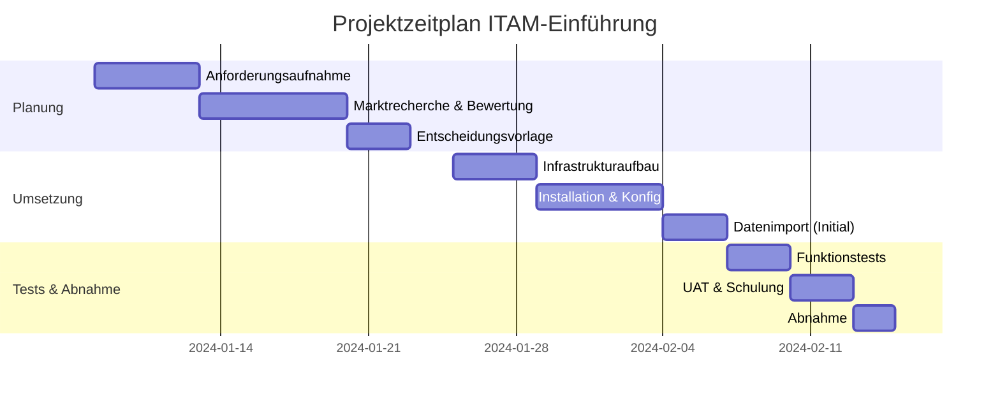
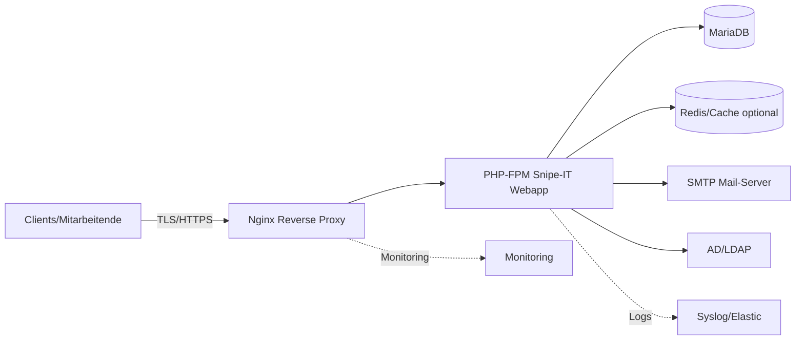
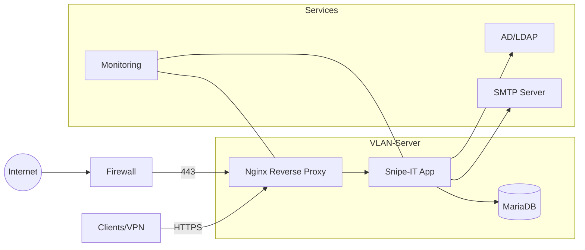
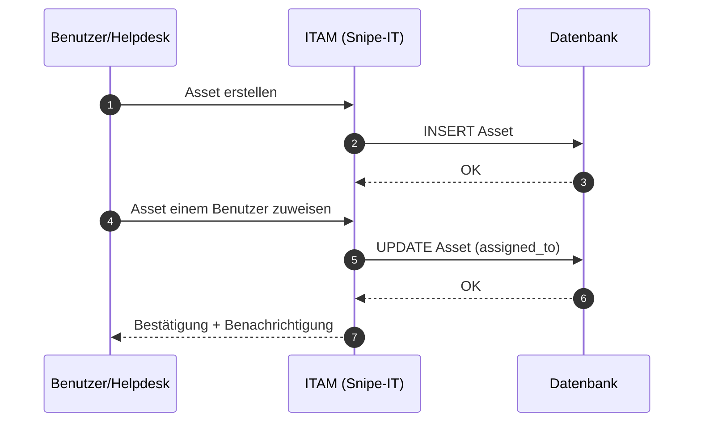
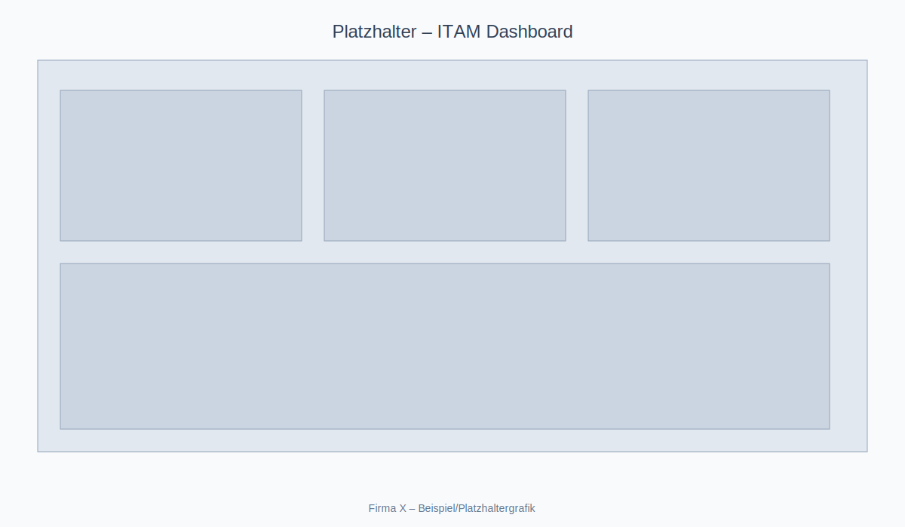
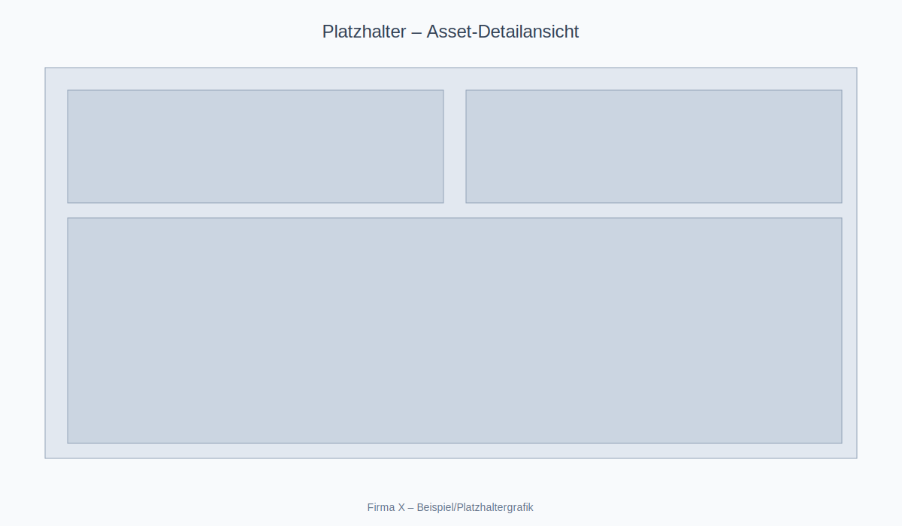

IHK-Abschlussprojekt – Projektdokumentation

Projekt: „Auswahl, Aufbau und Implementation einer IT-Asset- und Inventarmanagement-Software für die Firma X“

Autor: Vorname Nachname

Ausbildungsberuf: Fachinformatiker/in Systemintegration

Ausbildungsbetrieb: Firma X GmbH

Prüfung: IHK-Abschlussprüfung

Datum der Einreichung: TT.MM.JJJJ

Betreuer/in im Betrieb: Name Betreuer/in

Prüfungsnummer: [optional]

Hinweis: Diese Dokumentation ist als eigenständige, prüfungsgeeignete Projektdokumentation für die IHK konzipiert. Alle personenbezogenen Daten sind exemplarisch.

Inhaltsverzeichnis

1 Einleitung  
1.1 Projektbeschreibung  
1.2 Zielsetzung  
1.3 Ausgangssituation  
1.4 Projektabgrenzung und Annahmen

2 Projektumfeld  
2.1 Unternehmensbeschreibung (Firma X)  
2.2 Organisatorische und technische Rahmenbedingungen  
2.3 Stakeholder und Rollen  
2.4 Rechtliche und regulatorische Anforderungen

3 Projektplanung  
3.1 Anforderungen (funktional/nicht-funktional)  
3.2 Auswahlkriterien und Bewertungsmatrix  
3.3 Zeitplanung (Gantt)  
3.4 Kosten- und Budgetplanung  
3.5 Ressourcenplanung  
3.6 Risiken und Maßnahmen

4 Analyse & Vergleich möglicher IT-Asset-Management-Lösungen  
4.1 Marktübersicht  
4.2 Kurzbewertung der Kandidaten  
4.3 Vergleichstabelle und Gewichtung  
4.4 Entscheidung und Begründung

5 Aufbau & Umsetzung  
5.1 Zielarchitektur  
5.2 Infrastrukturaufbau  
5.3 Installation  
5.4 Konfiguration  
5.5 Datenmigration/Initialbefüllung  
5.6 Backup & Monitoring  
5.7 Sicherheit und Härtung

6 Tests & Abnahme  
6.1 Teststrategie  
6.2 Testfälle und Ergebnisse  
6.3 Sicherheitstests  
6.4 Benutzerakzeptanztest (UAT)  
6.5 Abnahme und Übergabe

7 Projektergebnisse  
7.1 Zielerreichung  
7.2 Kennzahlen (KPIs)  
7.3 Wirtschaftlichkeit/Nutzen

8 Fazit & Ausblick  
8.1 Betrieb und Wartung  
8.2 Weiterentwicklungen  
8.3 Lessons Learned

9 Abbildungsverzeichnis  
10 Tabellenverzeichnis  
11 Quellenverzeichnis  
12 Anhang (Screenshots, Diagramme, Netzpläne, Tabellen)

1 Einleitung

1.1 Projektbeschreibung

Im Rahmen der Abschlussprüfung im Ausbildungsberuf Fachinformatiker/in Systemintegration wurde für die Firma X die Auswahl, der Aufbau und die Implementation einer IT-Asset- und Inventarmanagement-Software (im Folgenden „ITAM-System“) durchgeführt. Ziel ist die zentrale, revisionssichere Verwaltung von Hardware-, Software- und Peripherie-Assets über den gesamten Lebenszyklus (Beschaffung, Zuweisung, Betrieb, Wartung, Außerbetriebnahme) sowie die Bereitstellung belastbarer Bestands-, Lizenz- und Compliance-Informationen.

1.2 Zielsetzung

Ziel des Projekts ist die produktive Einführung eines ITAM-Systems, das:

-   eine konsolidierte, aktuelle Inventarliste ermöglicht,
-   Gerätedaten mit Benutzer- und Standortinformationen verknüpft,
-   Lizenzinformationen verwaltet und Audits unterstützt,
-   Prozesse (Zuweisung, Rücknahme, Reparatur) standardisiert,
-   Datenimporte/-exporte (CSV/AD) und Automatisierung ermöglicht,
-   Sicherheits- und Compliance-Anforderungen (DSGVO, Nachvollziehbarkeit) erfüllt,
-   skalierbar, wartbar und kosteneffizient ist.

1.3 Ausgangssituation

Bei Firma X erfolgt die Asset-Verwaltung bislang überwiegend in dezentral gepflegten Excel-Listen und durch manuelle Abstimmungen. Es fehlen:

-   einheitliche Inventarnummern und Felder,
-   transparente Zuordnungen von Geräten zu Mitarbeitenden/Standorten,
-   verlässliche Lizenz- und Garantieinformationen,
-   standardisierte Prozesse und Berichte.

Dies führt zu Mehraufwänden, Medienbrüchen und erhöhtem Risiko bei Audits. Ein zentrales ITAM-System soll diese Defizite adressieren.

1.4 Projektabgrenzung und Annahmen

Im Projektumfang sind Auswahl, Installation, Grundkonfiguration, Datenübernahme (Initialimport) und Schulung enthalten. Nicht Bestandteil sind ERP-Integration, mobile App-Entwicklung und tiefgreifende CMDB-Funktionen außerhalb des Assetkontexts. Es wird angenommen, dass eine virtuelle Serverumgebung (VMware/Hyper-V) sowie Active Directory vorhanden sind.

2 Projektumfeld

2.1 Unternehmensbeschreibung (Firma X)

Firma X ist ein mittelständisches Unternehmen (~250 Mitarbeitende) mit Hauptsitz in Deutschland und zwei Außenstandorten. Die IT-Abteilung besteht aus 6 Personen (Administration, Support, Infrastruktur). Der Gerätebestand umfasst ca. 400 Hardware-Assets (Notebooks, Desktops, Monitore, Drucker, Netzwerkgeräte) sowie ca. 200 Softwarelizenzen.

2.2 Organisatorische und technische Rahmenbedingungen

-   Virtualisierte Serverlandschaft (VMware ESXi), Windows- und Linux-Server.
-   Active Directory (Windows Server), Microsoft 365.
-   Standard-Backup (Veeam), Monitoring (z. B. Icinga/Zabbix), Ticketsystem vorhanden.
-   Netzwerk mit getrennten VLANs (Server, Clients, Management).

2.3 Stakeholder und Rollen

-   Geschäftsführung: Budgetfreigabe, strategische Entscheidung.
-   IT-Leitung: Projektverantwortung, Abnahme.
-   Systemadministration: Umsetzung, Betrieb.
-   Helpdesk: Operative Nutzung, Datenpflege.
-   Einkauf/Controlling: Lizenz-/Kostenübersicht, Reports.

2.4 Rechtliche und regulatorische Anforderungen

-   DSGVO: Schutz personenbezogener Daten, Löschkonzepte, Zweckbindung.
-   Lizenz- und Urheberrecht: Nachweis von Nutzungsrechten.
-   IT-Sicherheitsrichtlinien (intern), BSI-Empfehlungen, Minimalprinzip.

3 Projektplanung

3.1 Anforderungen (funktional/nicht-funktional)

Tabelle 1: Konsolidierte Anforderungen

Quelle: Eigene Darstellung, Stand: TT.MM.JJJJ

| ID  | Kategorie        | Anforderung                                       | Priorität | Akzeptanzkriterium                    |
| --- | ---------------- | ------------------------------------------------- | --------- | ------------------------------------- |
| F1  | Funktional       | Zentrale Verwaltung von Hardware-/Software-Assets | Muss      | CRUD für Assets, Historie sichtbar    |
| F2  | Funktional       | AD-Anbindung (Benutzer, Gruppen)                  | Soll      | Import/Zuordnung von AD-Accounts      |
| F3  | Funktional       | CSV-Import/Export                                 | Muss      | Erfolgreicher Import von Startdaten   |
| F4  | Funktional       | Lizenzmanagement                                  | Soll      | Erfassung, Zuordnung, Warnungen       |
| F5  | Funktional       | Rollen-/Rechtekonzept                             | Muss      | Mind. Admin/IT/Leserollen             |
| F6  | Funktional       | Benachrichtigungen (E-Mail)                       | Kann      | SMTP-Integration, Vorlagen            |
| NF1 | Nicht-funktional | Webbasiert, On-Premises                           | Muss      | Betrieb im eigenen Rechenzentrum      |
| NF2 | Nicht-funktional | Sicherheit (TLS, RBAC)                            | Muss      | TLS erzwungen, Rollen umgesetzt       |
| NF3 | Nicht-funktional | Skalierbarkeit/Backup                             | Soll      | tägliche Sicherung, Wiederherstellung |

3.2 Auswahlkriterien und Bewertungsmatrix

Gewichtete Kriterien: Funktionsumfang (30 %), Integrationen (20 %), Betrieb/Administration (15 %), Sicherheit/Compliance (15 %), Kosten (15 %), Community/Support (5 %). Bewertet wurden Snipe-IT, GLPI, Lansweeper, ManageEngine AssetExplorer, Freshservice/ServiceNow (ITAM-Module).

3.3 Zeitplanung (Gantt)

Abbildung 1: Projektzeitplan (Gantt)

Quelle: Eigene Darstellung, Stand: TT.MM.JJJJ



3.4 Kosten- und Budgetplanung

Tabelle 2: Kostenplan (Investition/Betrieb)

Quelle: Eigene Darstellung, Annahmen; Preise beispielhaft

| Position                         | Einmalkosten (EUR) | Laufend/Jahr (EUR) | Bemerkung                           |
| -------------------------------- | ------------------ | ------------------ | ----------------------------------- |
| VM/Serverbereitstellung          | 0                  | 0                  | interne Ressourcen                  |
| Betriebssystem (Linux)           | 0                  | 0                  | Open Source                         |
| Datenbank (MariaDB)              | 0                  | 0                  | Open Source                         |
| Webserver (Nginx)                | 0                  | 0                  | Open Source                         |
| ITAM-Software (z. B. Snipe-IT)   | 0                  | 0                  | Open Source                         |
| Arbeitsaufwand (intern, 60 Std.) | 0                  | 0                  | Personalkosten getrennt ausgewiesen |
| Support/Plugins (optional)       | 500                | 300                | z. B. Add-ons                       |
| Backup-Speicher                  | 200                | 200                | zusätzlicher Storage                |

3.5 Ressourcenplanung

Tabelle 3: Ressourcen- und Rollenplanung

Quelle: Eigene Darstellung

| Rolle                       | Verantwortlichkeiten                | Einsatz (PT) |
| --------------------------- | ----------------------------------- | ------------ |
| Projektleitung (IT-Leitung) | Planung, Controlling, Abnahme       | 3            |
| Systemadministrator/in      | Installation, Konfiguration, Import | 6            |
| Helpdesk                    | Tests, Datenpflege, Schulung        | 2            |
| Einkauf/Controlling         | Kosten-/Lizenzabgleich              | 1            |

3.6 Risiken und Maßnahmen

Tabelle 4: Risikoregister

Quelle: Eigene Darstellung

| Risiko                          | Eintritt | Auswirkung | Maßnahme                          |
| ------------------------------- | -------- | ---------- | --------------------------------- |
| Dateninkonsistenzen beim Import | Mittel   | Mittel     | Validierung, Testimport, Rollback |
| Zeitverzug durch Abhängigkeiten | Niedrig  | Mittel     | Puffer, Eskalationsweg            |
| Akzeptanzprobleme               | Mittel   | Hoch       | Schulung, Pilotgruppe             |
| Sicherheitslücke                | Niedrig  | Hoch       | Härtung, Updates, Pen-Test        |

4 Analyse & Vergleich möglicher IT-Asset-Management-Lösungen

4.1 Marktübersicht

Der Markt bietet Open-Source- und kommerzielle ITAM-Lösungen. In die engere Auswahl wurden aufgenommen: Snipe-IT (Open Source), GLPI (Open Source, mit CMDB-Aspekten), Lansweeper (kommerziell, Discovery), ManageEngine AssetExplorer (kommerziell), Freshservice/ServiceNow (ITSM mit ITAM-Modulen).

4.2 Kurzbewertung der Kandidaten

-   Snipe-IT: Schlanke, fokussierte Asset-Verwaltung, gute Community, einfache Bedienung, REST-API, CSV-Import, AD/LDAP-Integration; Funktionsumfang ausreichend für KMU.
-   GLPI: Umfangreich, CMDB-Funktionen, Plugins; höhere Komplexität, erweiterte Integrationen; Einarbeitung nötig.
-   Lansweeper: Starker Fokus auf Discovery/Scanning; Lizenzkosten; Integration mit Drittsystemen.
-   ManageEngine AssetExplorer: Breiter Funktionsumfang, guter Support; Lizenzkosten und Administration.
-   Freshservice/ServiceNow: Sehr umfangreich, Enterprise-Fokus; hohe Kosten, ggf. Overhead für KMU.

4.3 Vergleichstabelle und Gewichtung

Tabelle 5: Vergleich der ITAM-Lösungen (gewichtete Bewertung)

Quelle: Eigene Darstellung; Skala 1 (schwach) bis 5 (sehr gut)

| Kriterium (Gewicht)           | Snipe-IT | GLPI | Lansweeper | AssetExplorer | Freshservice |
| ----------------------------- | -------: | ---: | ---------: | ------------: | -----------: |
| Funktionsumfang (30 %)        |        4 |    4 |          3 |             4 |            5 |
| Integrationen (20 %)          |        4 |    4 |          3 |             4 |            5 |
| Betrieb/Administration (15 %) |        5 |    3 |          4 |             4 |            3 |
| Sicherheit/Compliance (15 %)  |        4 |    4 |          4 |             4 |            5 |
| Kosten (15 %)                 |        5 |    5 |          3 |             3 |            1 |
| Community/Support (5 %)       |        5 |    4 |          3 |             4 |            4 |

Auswertung (Beispiel, gewichtet): Snipe-IT und GLPI liegen vorn; aufgrund geringerer Komplexität, Kostenfreiheit und guter Abdeckung der Muss-Anforderungen empfiehlt sich Snipe-IT für Firma X.

4.4 Entscheidung und Begründung

Entschieden wurde die Einführung von Snipe-IT (On-Premises) mit MariaDB, Nginx und AD/LDAP-Anbindung. Gründe: Kosteneffizienz, Fokussierung auf Asset-Lifecycle, einfache Administration, gute Community, ausreichender Funktionsumfang für KMU, DSGVO-konforme On-Premises-Betriebsoption.

5 Aufbau & Umsetzung

5.1 Zielarchitektur

Abbildung 2: Zielarchitektur (logische Komponenten)

Quelle: Eigene Darstellung



5.2 Infrastrukturaufbau

-   Virtuelle Maschine (4 vCPU, 8 GB RAM, 100 GB SSD), OS: Ubuntu LTS.
-   Netzwerk: Server-VLAN, Firewall-Freigaben: 443/TCP, 22/TCP (Admin), DB intern.
-   DNS-Eintrag itam.firma-x.local, interner ACME/TLS (z. B. Let’s Encrypt/ACME-intern).

Abbildung 3: Netzwerkdiagramm der ITAM-Umgebung

Quelle: Eigene Darstellung



5.3 Installation

Übersicht der Installationsschritte (Beispiel Ubuntu LTS):

1. System aktualisieren, Basis-Pakete installieren.
2. Nginx, MariaDB, PHP 8.x, Composer installieren.
3. Datenbank und Benutzer für Snipe-IT anlegen.
4. Snipe-IT aus Git beziehen, .env konfigurieren, App-Schlüssel generieren.
5. Webserver vHost, TLS, Firewall-Regeln setzen.
6. Anwendung initialisieren, Admin-Konto erstellen.

Beispielhafte Kommandos (vereinfacht):

```bash
sudo apt update && sudo apt -y upgrade
sudo apt -y install nginx mariadb-server php-fpm php-mysql php-xml php-gd php-cli php-curl php-zip unzip git composer
sudo mysql -e "CREATE DATABASE snipeit CHARACTER SET utf8mb4 COLLATE utf8mb4_unicode_ci;"
sudo mysql -e "CREATE USER 'snipeit'@'localhost' IDENTIFIED BY 'starkesPasswort!';"
sudo mysql -e "GRANT ALL PRIVILEGES ON snipeit.* TO 'snipeit'@'localhost'; FLUSH PRIVILEGES;"
cd /var/www && sudo git clone https://github.com/snipe/snipe-it.git && cd snipe-it
cp .env.example .env
php artisan key:generate
composer install --no-dev --prefer-dist
php artisan migrate --force
```

5.4 Konfiguration

-   AD/LDAP: Bind-Nutzer, Base DN, Attributzuordnung (userPrincipalName), SSL/TLS.
-   SMTP: Absenderadresse, TLS, Authentifizierung, Benachrichtigungs-Templates.
-   Rollen/Rechte: Admin, IT (Bearbeiter), Helpdesk (eingeschränkt), Lesen (Audits).
-   Inventarfelder: Inventarnummernformat, Standort, Kostenstelle, Garantieende.
-   Asset-Lebenszyklus: Prozesse für Zuweisung, Rücknahme, Reparatur, RMA.

5.5 Datenmigration/Initialbefüllung

-   Datenbereinigung der Altbestände (Excel): Dubletten entfernen, Pflichtfelder ergänzen.
-   Mapping nach Snipe-IT-Feldern (CSV). Testimport in Staging, dann Produktion.
-   Validierung und Stichprobenprüfung.

5.6 Backup & Monitoring

-   Datenbank-Dumps (täglich), Konfigurations-Backups, Offsite-Aufbewahrung.
-   Monitoring: Service-Checks (HTTP 200/TLS), DB-Health, Systemressourcen.
-   Logaggregation (Syslog/Elastic), Alarmierung.

5.7 Sicherheit und Härtung

-   TLS-Erzwingung, sichere Cipher, HSTS (intern geeignet), regelmäßige Updates.
-   Minimalprinzip (RBAC), 2-Faktor-Authentisierung (sofern Add-on verfügbar).
-   Firewall-Whitelist, Fail2ban/Rate-Limits, Sicherheits-Header.
-   Protokollierung und regelmäßige Review der Admin-Aktivitäten.

6 Tests & Abnahme

6.1 Teststrategie

Kombination aus Funktions-, Integrations-, Sicherheits- und Akzeptanztests auf Staging- und Produktionsumgebung mit definierten Testfällen und Abnahmekriterien.

6.2 Testfälle und Ergebnisse

Tabelle 6: Testplan (Auszug)

Quelle: Eigene Darstellung

| TC   | Beschreibung   | Erwartetes Ergebnis                                  | Ergebnis  |
| ---- | -------------- | ---------------------------------------------------- | --------- |
| TC01 | Login via LDAP | Benutzer kann sich mit AD-Daten anmelden             | Bestanden |
| TC02 | Asset anlegen  | Neues Asset mit Inventarnr. sichtbar                 | Bestanden |
| TC03 | Asset zuweisen | Asset ist Benutzer zugeordnet, Historie aktualisiert | Bestanden |
| TC04 | CSV-Import     | 100 Datensätze korrekt importiert                    | Bestanden |
| TC05 | Mail-Benachr.  | E-Mail bei Zuweisung versendet                       | Bestanden |

6.3 Sicherheitstests

-   TLS-Konfiguration geprüft (SSL Labs intern), sichere Cipher, keine bekannten Schwächen.
-   Rollen-/Rechteprüfungen (Least Privilege) durchgeführt.
-   Schwachstellenscan der VM (ohne produktionskritische Exploits) durchgeführt; keine kritischen Findings.

6.4 Benutzerakzeptanztest (UAT)

Pilotgruppe (Helpdesk, Administration) validierte zentrale Use-Cases; Feedback floss in Felddefinitionen und E-Mail-Vorlagen ein. Dokumentierte Schulungsunterlagen bereitgestellt.

6.5 Abnahme und Übergabe

Formale Abnahme durch IT-Leitung nach erfolgreichem Abschluss aller Muss-Tests, Übergabeprotokoll, Betriebs- und Wartungskonzept.

7 Projektergebnisse

7.1 Zielerreichung

Alle Muss-Anforderungen erfüllt; Soll-Anforderungen größtenteils umgesetzt. Zentrale Asset-Datenbank produktiv, Prozesse standardisiert, Reporting vorhanden.

7.2 Kennzahlen (KPIs)

Tabelle 7: KPIs vor/nach Einführung (Beispielwerte)

Quelle: Eigene Darstellung

| KPI                   | Vorher  | Nachher | Veränderung  |
| --------------------- | ------- | ------- | ------------ |
| Inventarisierungsgrad | ~60 %   | >95 %   | +35 %-Punkte |
| Suchzeit pro Asset    | ~10 min | ~1 min  | -90 %        |
| Audit-Abweichungen    | 12      | 2       | -83 %        |
| Lizenzüberziehungen   | 3       | 0       | eliminiert   |

7.3 Wirtschaftlichkeit/Nutzen

Kostenersparnis durch Wegfall manueller Tätigkeiten und Excel-Pflege; geringeres Audit-Risiko; verbesserte Transparenz bei Ersatzbeschaffungen; fundierte Entscheidungsgrundlagen (Berichte, Lifecycle-Daten).

8 Fazit & Ausblick

8.1 Betrieb und Wartung

Regelmäßige Updates (Sicherheits- und Feature-Releases), Datenpflegeprozesse (Helpdesk), Überwachung (Monitoring, Backup-Restore-Tests), jährliche Review der Felddefinitionen und Nutzerrollen.

8.2 Weiterentwicklungen

-   Automatisches Discovery (SNMP/WMI) über ergänzende Tools.
-   Mobile Erfassung (Barcode/QR) über App oder MDM-Integration.
-   SSO (SAML/OIDC), erweiterte Reporting-Dashboards, Service-Management-Integration (Ticketsystem).

8.3 Lessons Learned

Frühe Datenbereinigung ist erfolgskritisch; klare Rollen und Prozesse erhöhen Datenqualität; Pilotgruppe reduziert Akzeptanzrisiken; einfache Lösungen sind im KMU-Umfeld oft nachhaltiger.

9 Abbildungsverzeichnis

-   Abbildung 1: Projektzeitplan (Gantt). Quelle: Eigene Darstellung.
-   Abbildung 2: Zielarchitektur (logische Komponenten). Quelle: Eigene Darstellung.
-   Abbildung 3: Netzwerkdiagramm der ITAM-Umgebung. Quelle: Eigene Darstellung.
-   Abbildung 4: UML-Sequenzdiagramm: Asset-Zuweisung. Quelle: Eigene Darstellung.
-   Abbildung 5: Screenshot: ITAM-Dashboard (Beispiel). Quelle: Eigene Darstellung.
-   Abbildung 6: Screenshot: Asset-Detailansicht (Beispiel). Quelle: Eigene Darstellung.

10 Tabellenverzeichnis

-   Tabelle 1: Konsolidierte Anforderungen. Quelle: Eigene Darstellung.
-   Tabelle 2: Kostenplan (Investition/Betrieb). Quelle: Eigene Darstellung.
-   Tabelle 3: Ressourcen- und Rollenplanung. Quelle: Eigene Darstellung.
-   Tabelle 4: Risikoregister. Quelle: Eigene Darstellung.
-   Tabelle 5: Vergleich der ITAM-Lösungen (gewichtete Bewertung). Quelle: Eigene Darstellung.
-   Tabelle 6: Testplan (Auszug). Quelle: Eigene Darstellung.
-   Tabelle 7: KPIs vor/nach Einführung (Beispielwerte). Quelle: Eigene Darstellung.

11 Quellenverzeichnis

[1] Snipe-IT Dokumentation – „Snipe-IT Docs“. Zugriff: TT.MM.JJJJ. `https://snipe-it.readme.io/`  
[2] GLPI Projekt – Dokumentation. Zugriff: TT.MM.JJJJ. `https://glpi-project.org/`  
[3] Lansweeper – Produktdokumentation. Zugriff: TT.MM.JJJJ. `https://www.lansweeper.com/`  
[4] ManageEngine AssetExplorer – Dokumentation. Zugriff: TT.MM.JJJJ. `https://www.manageengine.com/products/asset-explorer/`  
[5] Freshservice – Asset Management. Zugriff: TT.MM.JJJJ. `https://freshservice.com/`  
[6] ServiceNow – IT Asset Management. Zugriff: TT.MM.JJJJ. `https://www.servicenow.com/`  
[7] BSI – IT-Grundschutz-Kompendium. Zugriff: TT.MM.JJJJ. `https://www.bsi.bund.de/`  
[8] DSGVO – Verordnung (EU) 2016/679. Zugriff: TT.MM.JJJJ. `https://eur-lex.europa.eu/`  
[9] OWASP – Security Best Practices. Zugriff: TT.MM.JJJJ. `https://owasp.org/`

12 Anhang (Screenshots, Diagramme, Netzpläne, Tabellen)

Abbildung 4: UML-Sequenzdiagramm: Asset-Zuweisung

Quelle: Eigene Darstellung



Abbildung 5: Screenshot: ITAM-Dashboard (Beispiel)

Quelle: Eigene Darstellung



Abbildung 6: Screenshot: Asset-Detailansicht (Beispiel)

Quelle: Eigene Darstellung



Zusätzliche Hinweise:

-   Verzeichnisstruktur für Anhänge:

```
anhang/
  screenshot-dashboard.svg
  screenshot-asset-detail.svg
  export-beispiel.csv
```

-   Die in dieser Dokumentation verwendeten Produkt- und Markennamen sind Eigentum der jeweiligen Rechteinhaber.

Deckblatt (Druckversion)

Projekttitel: „Auswahl, Aufbau und Implementation einer IT-Asset- und Inventarmanagement-Software für die Firma X“  
Name: Vorname Nachname  
Ausbildungsberuf: Fachinformatiker/in Systemintegration  
Ausbildungsbetrieb: Firma X GmbH  
Prüfung: IHK-Abschlussprüfung  
Datum: TT.MM.JJJJ  
Betreuer/in: Name Betreuer/in

Unterschrift Projektverantwortliche/r: \***\*\*\*\*\*\*\***\_\_\***\*\*\*\*\*\*\***  
Unterschrift Auszubildende/r: **\*\***\*\***\*\***\_\_\_\_**\*\***\*\***\*\***
